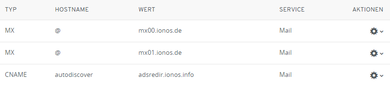
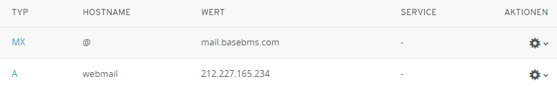
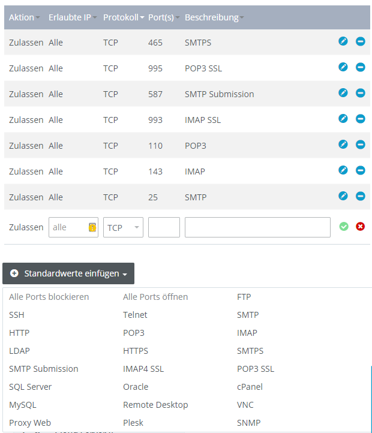
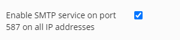
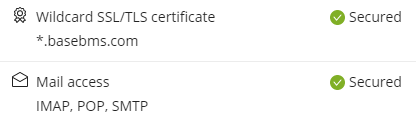
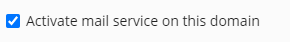
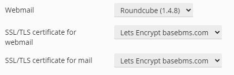
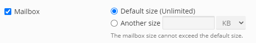

# IONOS - Plesk-Webmailer Roundcube nutzen und in GMail einrichten

IONOS bietet standardmäßig einen Webmailer, den ich aber nicht nutzen wollte. Ich wollte einen Webmailer mit Catchall über Plesk direkt nutzen. Außerdem war es mein Ziel nicht nur den Webmailer zu nutzen, sondern auch in GMail alle E-Mails zu empfangen und E-Mails mit der eigenen Domain xyz@mydomain.com statt xyz@gmail.com zu versenden.

## 1. DNS Einträge ändern

Die DNS Einträge für den IONOS-Webmailer habe ich unter **Menü** > **Domain & SSL** entfernt und zwei eigenen angelegt.

Die originalen Einstellungen:

Wurden geändert zu:

## 2. Firewall Portfreigabe

Die Ports für SMTP, POP und IMAP müssen für Gmail geöffnet werden.
Dazu gehe auf Menü > Server & Cloud > Netzwerk > Firewall-Richtlinien

Ich habe einfach mal alle geöffnet, dies ist mit dem Dropdown "Standardwerte einfügen" schnell erledigt. Aber danach muss man ein wenig warten, bis der Server die Einstellungen übernommen hat.

## 3. Plesk einstellen

### SMTP aktivieren

Möchte man SMTP verwenden muss zunächst SMTP aktiviert werden unter Tools & Settings > Server-Wide Mail Settings.

### SSL einrichten

Ich habe ein "Let's Encrypt" Wildcard Zertifikat erstellt, welches auch IMAP, POP, SMTP einschließt.
Für das Zertifikat musste ein TXT DNS-Eintrag namens "_acme-challenge" über IONOS (nicht Plesk) eingetragen werden.

### Mails einrichten

Unter "Mail Settings" habe ich ein paar Einstellungen gemacht:

Dann habe ich unter "Mail Accounts" eine E-Mail-Account angelegt mit aktivierter Mailbox:

Auf der Übersichtsseite drückt man nun auf den Webmailer Button für Roundcube:

Wenn alles korrekt ist, startet der Webmailer und man kann E-Mails schreiben und empfangen.

## Gmail

Nun konnte ich auch in Gmail mit Hilfe der Zugangsdaten SMTP und POP3 einrichten.

